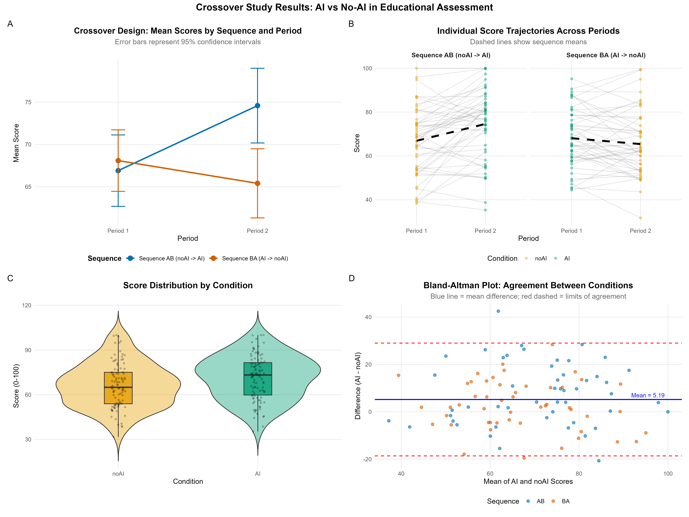
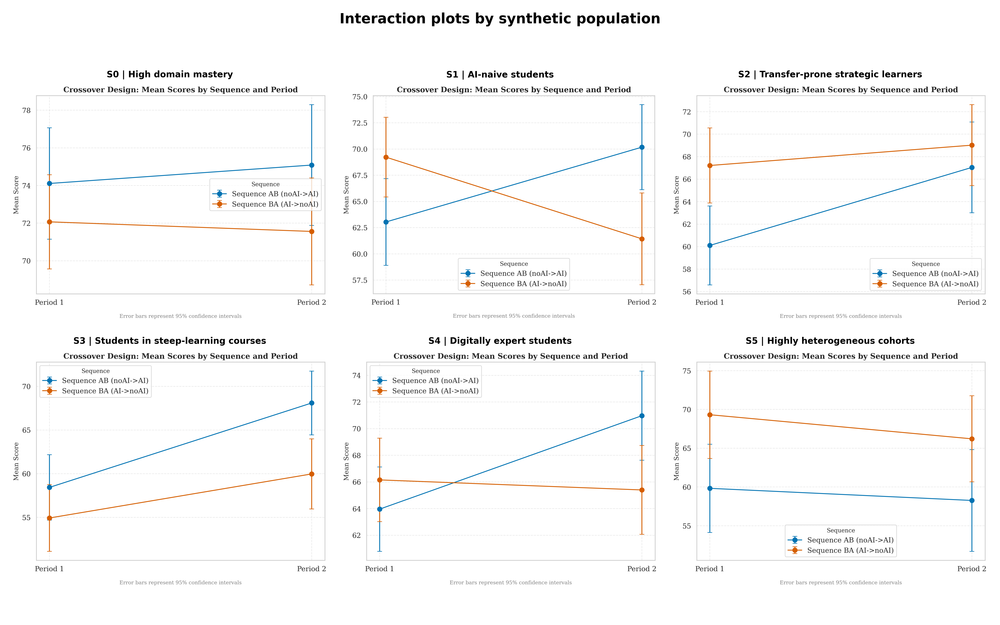

# crossover-edtech-toolkit

An open-source platform for conducting **replicable crossover (AB/BA) experimental studies** evaluating the impact of generative AI on learning in higher education.
{: .fs-6 .fw-300 }

[Get Started](getting-started){: .btn .btn-primary .fs-5 .mb-4 .mb-md-0 .mr-2 }
[Tutorial](tutorial/){: .btn .fs-5 .mb-4 .mb-md-0 }

---

## What is this?

A complete research toolkit that provides everything you need to run a **crossover experimental study** in your classroom:

| Component | What it does |
|:----------|:-------------|
| **Web application** | Firebase-based platform for data collection with conditional logic, anonymous tracking, and rubric evaluation |
| **Validated instruments** | Pre/post questionnaires, Likert surveys, evaluation rubrics -- all editable and adaptable |
| **Analysis pipelines** | Complete statistical analysis in both **R** and **Python** (10 modular scripts each) |
| **Sample data** | One default synthetic dataset for onboarding, plus scenario-based synthetic validation to stress-test the pipeline |
| **Documentation** | Study design guide, instrument adaptation manual, ethics template, deployment instructions |

## The crossover design

Every student experiences **both conditions** (with AI and without AI), eliminating between-subject confounds:

| | Period 1 | Period 2 |
|:--|:---------|:---------|
| **Sequence AB** (50%) | Challenge **without** AI | Challenge **with** AI |
| **Sequence BA** (50%) | Challenge **with** AI | Challenge **without** AI |

This means each student serves as their own control, dramatically increasing statistical power compared to parallel-group designs.

## Statistical model

```
Y_ijk = mu + pi_j + tau_k + lambda_l + S_i + epsilon_ijk
```

Where `mu` = grand mean, `pi` = period effect, `tau` = treatment effect (AI vs noAI), `lambda` = carryover effect, `S` = random subject effect, `epsilon` = residual error.

## Analysis pipeline output

The toolkit generates publication-ready results in under 60 seconds:



*Composite figure showing interaction plot, individual trajectories, effect size forest plot, and score distributions -- generated automatically from sample data.*

## Scenario-based validation

The toolkit also supports a second synthetic workflow: instead of running a single demo dataset, you can generate several **plausible classroom populations** and verify that the pipeline identifies the correct pattern in each one.

This is useful when you want to test questions such as:

- Does the carryover diagnostic activate when carryover is built into the data?
- Does a strong period effect show up as a period effect rather than being misread as treatment?
- Do effect-size panels widen when the cohort is intentionally heterogeneous?

The current scenario suite includes AI-naive students, digitally expert students, highly heterogeneous cohorts, and other classroom profiles chosen to stress-test interpretation rather than to mimic any one empirical study. See [Synthetic Validation](reference/synthetic-validation) for details.



*Interaction plots across six synthetic classroom populations used to test whether the reporting layer distinguishes treatment, period, sequence, and heterogeneity patterns correctly.*

## Who is this for?

- **Educational researchers** studying the impact of AI (or any intervention) on learning
- **University lecturers** participating in teaching innovation projects
- **Institutions** seeking evidence-based policies on generative AI in education
- **Graduate students** learning experimental design and statistical analysis

## Citation

```bibtex
@article{torrecilla2026crossover,
  title   = {crossover-edtech-toolkit: An Open-Source Platform for Replicable
             Crossover Experimental Studies Evaluating Generative AI in Education},
  author  = {Torrecilla Pinero, Jesús Ángel and others},
  journal = {SoftwareX},
  year    = {2026}
}
```

## License

This project is licensed under the [MIT License](https://github.com/jtorreci/crossover-edtech-toolkit/blob/main/LICENSE). You are free to use, modify, and distribute it for any purpose.
