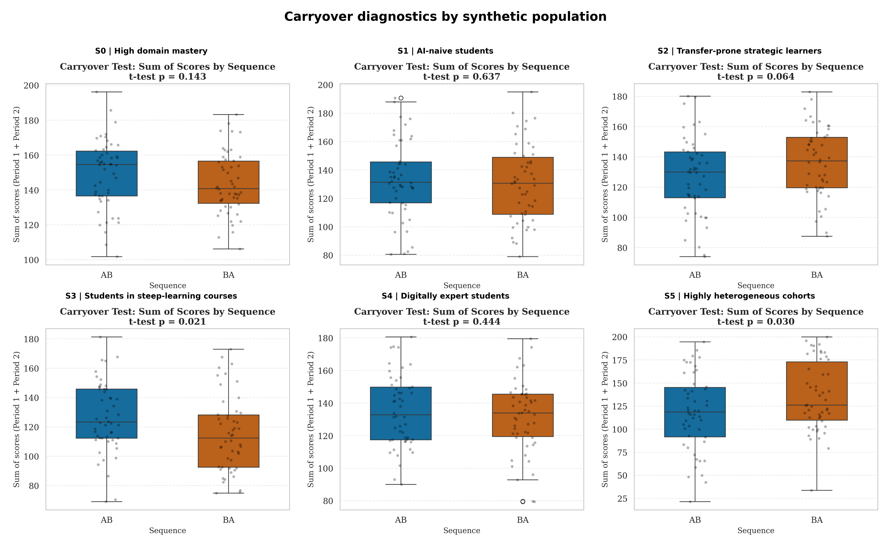
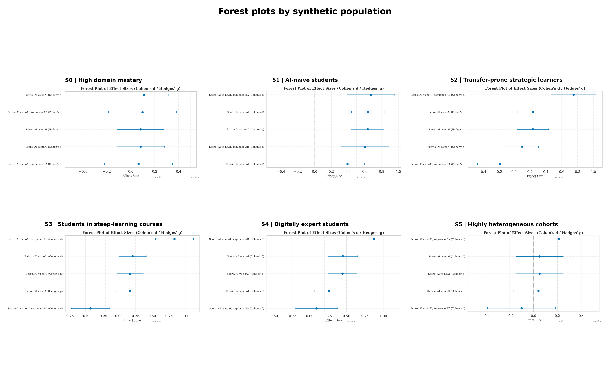

# Synthetic Validation
{: .no_toc }

How to use scenario-based synthetic cohorts to test whether the pipeline detects treatment, period, sequence, and carryover patterns under known conditions.
{: .fs-6 .fw-300 }

## Table of contents
{: .no_toc .text-delta }

1. TOC
{:toc}

---

## Why this exists

The toolkit includes two different uses of synthetic data:

1. The default sample dataset in `sample_data/crossover_sample_data.csv` is a single worked example for onboarding, demonstrations, and smoke tests.
2. The scenario-validation workflow creates **multiple synthetic cohorts** with different programmed patterns and uses them to verify that the pipeline reacts coherently.

The second use case is methodological rather than inferential. It is not meant to predict what real students will do. It is meant to answer a narrower question: when the data contain a known pattern, does the pipeline identify it and present it clearly enough for a researcher to interpret it correctly?

## The six synthetic populations

The validation workflow generates six cohorts, each with 100 synthetic students in a 2x2 crossover design.

| ID | Population proxy | Main programmed feature | What the pipeline should highlight |
|:---|:-----------------|:------------------------|:-----------------------------------|
| `S0` | High domain mastery | Near-null treatment effect, low variance | Tight intervals and little separation between AI and noAI |
| `S1` | AI-naive students | Large positive treatment effect | Clear paired difference and stronger AI advantage |
| `S2` | Transfer-prone strategic learners | Explicit carryover in the second period | Carryover diagnostics should activate |
| `S3` | Students in steep-learning courses | Large period effect | Models should attribute more change to period than to condition |
| `S4` | Digitally expert students | Sequence-sensitive treatment effect | Interaction plot and sequence-level estimates should diverge |
| `S5` | Highly heterogeneous cohorts | Small effect with large dispersion | Wider confidence intervals and noisier individual trajectories |

These scenarios are designed to approximate recognizable classroom populations rather than abstract statistical cases. They give you a quick way to test whether the reporting layer helps distinguish genuine treatment differences from period effects, carryover, or heterogeneity.

## Running the scenario validation

From the project root:

```bash
pip install -r analysis/python/requirements.txt
python sample_data/generate_scenario_validation.py
```

This script will:

- generate six synthetic cohorts in `sample_data/scenario_validation/`
- run the full Python analysis pipeline on each cohort
- save per-scenario logs and outputs
- build comparison panels across all scenarios

If you already have scenario outputs and only want to rebuild the panels:

```bash
python sample_data/build_scenario_panels.py
```

## Output structure

The scenario-validation workflow writes its results to:

```text
sample_data/scenario_validation/
├── scenario_catalog.csv
├── S0/
│   ├── sample_data/
│   ├── output/
│   ├── pipeline_stdout.log
│   └── pipeline_stderr.log
├── ...
└── panels/
    ├── interaction_plots_by_synthetic_population.png
    ├── carryover_diagnostics_by_synthetic_population.png
    ├── forest_plots_by_synthetic_population.png
    └── composite_toolkit_outputs_by_synthetic_population.png
```

## What to look for

The panels below illustrate the intended purpose of the validation workflow.


*Interaction plots across the six synthetic populations. These are useful for checking whether treatment, period, and sequence patterns appear with the expected visual structure.*



*Carryover diagnostics across the same populations. Scenario `S2` is the critical stress test because it includes carryover by design.*



*Effect-size summaries across populations. The main visual check is whether intervals tighten or widen in line with treatment magnitude and cohort heterogeneity.*

## Interpretation limits

Scenario-based synthetic validation is useful, but it has a limited scope.

- It validates the computational workflow and the interpretability of the outputs.
- It does **not** validate the empirical study on its own.
- It does **not** imply that real cohorts will reproduce these patterns.
- It does **not** replace pilot testing, power analysis, or sensitivity analysis on plausible study parameters.

Used correctly, it is a practical bridge between a bare software smoke test and a full methodological simulation study.
