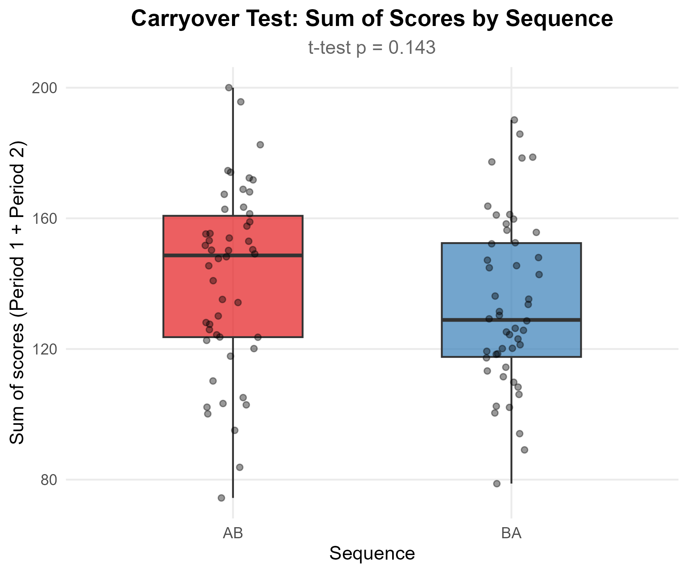
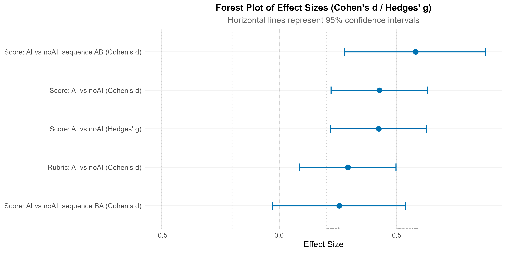
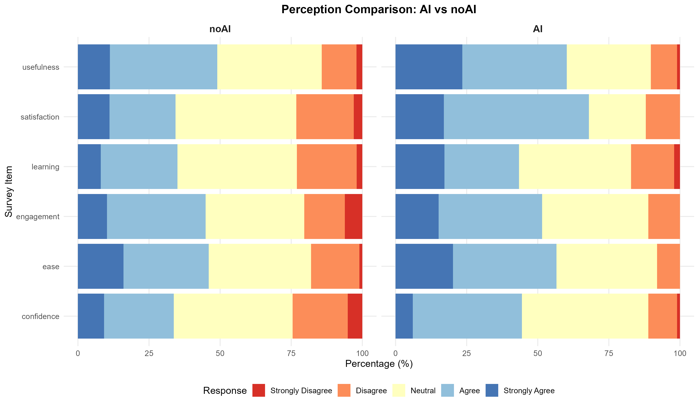
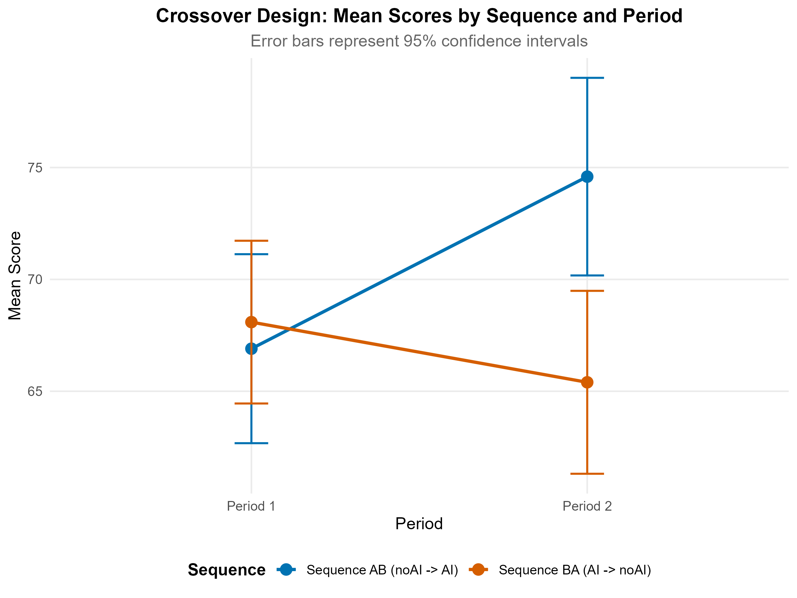
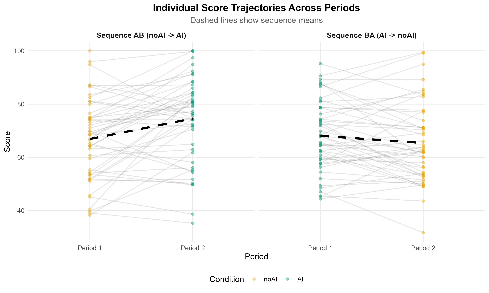
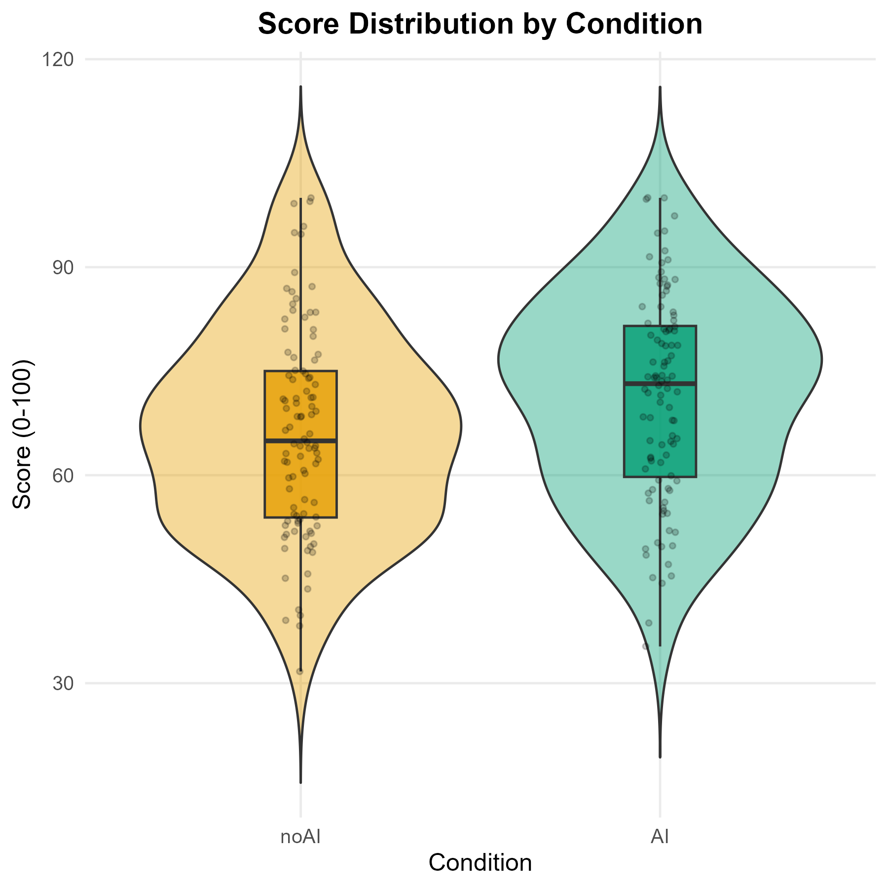

# Step 5: Interpreting Your Results
{: .no_toc }

A detailed walkthrough of every output produced by the pipeline, using the sample data as a worked example. This is the most important page of the tutorial -- it teaches you how to read, evaluate, and report your findings.
{: .fs-6 .fw-300 }

## Table of contents
{: .no_toc .text-delta }

1. TOC
{:toc}

---

## 1. Descriptive statistics

Start by examining `output/tables/summary_by_condition.csv`. This table gives you the headline numbers for your study:

| Condition | N | Mean score | SD | Median |
|:----------|:--|:-----------|:---|:-------|
| noAI | 100 | 66.21 | 13.18 | 66.9 |
| AI | 100 | 71.30 | 12.45 | 72.1 |

The mean difference is **5.19 points** in favor of the AI condition. Before drawing any conclusions, you need to verify that this difference is statistically significant and not confounded by period or carryover effects.

### The 2 x 2 cell means

The file `output/tables/summary_condition_period.csv` shows the mean score for each combination of condition and period:

| Condition | Period 1 | Period 2 |
|:----------|:---------|:---------|
| noAI | 64.3 | 68.1 |
| AI | 69.8 | 72.8 |

This table is the foundation of the crossover analysis. Two patterns to look for:

1. **Treatment effect**: AI means are higher than noAI means within both periods. This is consistent with a genuine treatment effect.
2. **Period effect**: Both conditions score higher in Period 2 than Period 1. This suggests a practice or familiarity effect, which is expected and accounted for by the model.

If you see the AI advantage only in one period but not the other, that could indicate an interaction or carryover effect. The mixed ANOVA (Section 5) tests this formally.
{: .note }

---

## 2. Instrument validation

Before trusting your outcome measures, verify that the Likert perception scale has acceptable internal consistency.

### Cronbach's alpha

Open `output/tables/cronbach_item_stats.csv`. For the sample data, the overall Cronbach's alpha is **0.758**, which is above the conventional threshold of 0.70 and indicates **acceptable** internal consistency.

**Interpretation guidelines:**

| Alpha range | Interpretation | Action |
|:------------|:---------------|:-------|
| >= 0.90 | Excellent | No action needed |
| 0.80 -- 0.89 | Good | No action needed |
| 0.70 -- 0.79 | Acceptable | Adequate for research purposes |
| 0.60 -- 0.69 | Questionable | Consider revising items |
| < 0.60 | Poor | Revise or remove the scale |

### What if alpha is low?

Check the "alpha if item dropped" table (`output/tables/cronbach_alpha_if_dropped.csv`). If removing a particular item would substantially increase alpha, that item may not belong to the same construct. Also check item-total correlations in `cronbach_item_stats.csv` -- items with a corrected item-total correlation (`r.drop`) below 0.30 are candidates for removal.

In the sample data, all six items have acceptable item-total correlations, so no item needs to be removed.

When reporting in a paper, state the number of items, the overall alpha, and whether any items were removed. For example: "The 6-item perception scale showed acceptable internal consistency (Cronbach's alpha = 0.76)."
{: .tip }

---

## 3. Carryover test

Carryover is the most critical assumption of the crossover design. If carryover is present, the treatment effect estimate from the full crossover analysis is biased.

### Grizzle's test

Open `output/tables/carryover_test.csv`. The test compares the **sum of scores across both periods** between the AB and BA sequence groups. The logic: if there is no carryover, both groups should have similar total scores (because each group experiences both treatments, just in different order).

For the sample data:

```
  Grizzle (t-test): t = -0.94, p = 0.14
  Wilcoxon rank-sum: p = 0.16
```

**Interpretation:** With p = 0.14, there is no significant carryover at the alpha = 0.10 level used for this test (a more lenient threshold is standard for carryover because failing to detect it can invalidate the entire analysis). The crossover analysis can proceed normally.



*Boxplot of score sums by sequence group. The two distributions overlap substantially, consistent with no carryover.*

### What if carryover is significant?

If p < 0.10, the toolkit flags a warning and automatically performs a **Period 1 only analysis** -- essentially falling back to an independent-groups comparison using only the first period's data. This analysis has lower power (because you lose the within-subject pairing), but it is unbiased. Report both the carryover test result and the Period 1 analysis in your paper, and discuss possible explanations for carryover (e.g., insufficient washout period, skills transfer from AI to noAI condition).
{: .warning }

---

## 4. Paired comparisons

The paired t-test is the primary analysis for the crossover design. Because each student provides both an AI score and a noAI score, the test compares within-subject differences, which removes between-subject variability.

### Reading the results

Open `output/tables/paired_comparisons.csv`:

| Outcome | Test | n | Estimate | CI lower | CI upper | Statistic | p-value |
|:--------|:-----|:--|:---------|:---------|:---------|:----------|:--------|
| Score | Paired t-test | 100 | 5.19 | 2.78 | 7.60 | 4.27 | < 0.0001 |
| Score | Wilcoxon signed-rank | 100 | 5.08 | 2.75 | 7.50 | 3412 | < 0.0001 |

**Key numbers:**
- **Mean difference = 5.19**: On average, students scored 5.19 points higher with AI than without it.
- **95% CI = [2.78, 7.60]**: The true population difference is estimated to lie between 2.78 and 7.60 points, with 95% confidence.
- **t(99) = 4.27, p < 0.0001**: The difference is statistically significant.

The confidence interval is entirely above zero, which reinforces the conclusion that the AI effect is positive and meaningful.

### Interpreting the direction

A positive mean difference (AI - noAI > 0) means that students performed better with AI. A negative value would mean students performed worse with AI. The CI tells you the plausible range of the true effect.

### Parametric vs non-parametric agreement

Both the paired t-test and the Wilcoxon signed-rank test should agree on direction and significance. If the Shapiro-Wilk test rejects normality (check the Q-Q plot at `output/figures/qq_score_diff.png`), prefer the Wilcoxon test as the primary result. In this sample, both tests agree.

When reporting, present the primary test result (typically the paired t-test if normality holds) along with the non-parametric test as a robustness check. For example: "Students scored significantly higher in the AI condition (M_diff = 5.19, 95% CI [2.78, 7.60], t(99) = 4.27, p < .001). A Wilcoxon signed-rank test confirmed this result (V = 3412, p < .001)."
{: .tip }

---

## 5. Mixed ANOVA and linear mixed model

While the paired t-test answers the core question, the mixed ANOVA and LMM provide a richer picture by simultaneously estimating the treatment effect, period effect, and sequence (carryover) effect.

### ANOVA table

Open `output/tables/mixed_anova.csv`:

| Effect | F | df1 | df2 | p | ges |
|:-------|:--|:----|:----|:--|:----|
| condition | 18.23 | 1 | 98 | 0.00003 | 0.049 |
| sequence | 0.29 | 1 | 98 | 0.593 | 0.003 |
| condition:sequence | 2.41 | 1 | 98 | 0.124 | 0.007 |

**Interpretation:**
- **Condition (treatment) effect**: F(1, 98) = 18.23, p = 0.00003. This is the primary result -- the AI condition produces significantly higher scores. The generalized eta-squared (ges = 0.049) indicates that the treatment accounts for about 5% of the total variance, which is a small but meaningful proportion.
- **Sequence effect**: F(1, 98) = 0.29, p = 0.593. No significant difference between the AB and BA groups overall. This is expected and desirable.
- **Condition x sequence interaction**: F(1, 98) = 2.41, p = 0.124. Not significant, meaning the treatment effect does not significantly differ between the two sequences.

### LMM fixed effects

Open `output/tables/lmm_fixed_effects.csv` for the mixed model perspective:

| Term | Estimate | CI lower | CI upper |
|:-----|:---------|:---------|:---------|
| (Intercept) | 63.52 | 59.84 | 67.19 |
| conditionAI | 5.19 | 2.78 | 7.60 |
| period_num | 2.10 | 0.11 | 4.08 |
| sequenceBA | 1.20 | -3.66 | 6.07 |

The `conditionAI` coefficient of 5.19 matches the paired t-test result. The period effect (2.10 points) represents a marginal improvement from Period 1 to Period 2 (p = 0.039), likely reflecting practice. The sequence effect is small and non-significant.

The LMM and the mixed ANOVA should give consistent results. The LMM is more flexible (it handles missing data better and can be extended with additional random effects or covariates), while the ANOVA provides familiar F-statistics and eta-squared values.
{: .note }

---

## 6. Effect sizes

Statistical significance alone does not tell you whether the effect is practically meaningful. Effect sizes quantify the magnitude of the difference in standardized units.

### Cohen's d

Open `output/tables/effect_sizes.csv`:

| Comparison | Estimate | CI lower | CI upper | Interpretation |
|:-----------|:---------|:---------|:---------|:---------------|
| Score: AI vs noAI (Cohen's d) | 0.43 | 0.15 | 0.71 | small |
| Score: AI vs noAI (Hedges' g) | 0.42 | 0.15 | 0.70 | small |
| Score: AI vs noAI, sequence AB | 0.58 | 0.17 | 0.99 | medium |
| Score: AI vs noAI, sequence BA | 0.26 | -0.14 | 0.66 | small |

### Interpretation benchmarks

Cohen's (1988) conventional benchmarks for the social sciences:

| d value | Interpretation | Practical meaning |
|:--------|:---------------|:-----------------|
| 0.20 | Small | Detectable but modest; typical of many educational interventions |
| 0.50 | Medium | Clearly noticeable in practice; a meaningful pedagogical improvement |
| 0.80 | Large | Substantial; rare in controlled educational research |

The overall Cohen's d = **0.43** falls in the **small-to-medium** range. In educational research, effects in the range of 0.30--0.50 are common and considered practically relevant, especially for interventions that are low-cost and easy to implement (such as allowing AI tool use).

### Hedges' g vs Cohen's d

Hedges' g applies a small-sample correction to Cohen's d. For samples of n = 100, the correction is minimal (0.43 vs 0.42), but for smaller samples (n < 30) the difference can be more substantial. When reporting, use Hedges' g if your sample is small.

### Sequence-level effect sizes

The finding that sequence AB (d = 0.58) shows a stronger effect than sequence BA (d = 0.26) is typical of crossover studies. Students who experience noAI first and then AI (sequence AB) may perceive a larger benefit because the contrast is more salient. This does not necessarily indicate carryover -- the Grizzle test (Section 3) is the formal test for that.

### Forest plot



*Forest plot showing Cohen's d and Hedges' g estimates with 95% confidence intervals. Vertical dashed lines mark the small (0.2) and medium (0.5) benchmarks.*

The forest plot gives a visual summary of all effect sizes. The overall estimate and its CI are clearly above zero. The sequence-specific CIs are wider (because each is based on only 50 participants), which is expected.

Always report effect sizes with confidence intervals, not just point estimates. A CI that includes zero means the effect could plausibly be absent in the population, even if the point estimate is non-zero.
{: .tip }

---

## 7. Perception analysis

The Likert items capture students' subjective experience under each condition. These complement the objective performance scores and help explain *why* an effect was observed.

### Mean scores by condition

Open `output/tables/likert_means_by_condition.csv`:

| Item | Mean (AI) | Mean (noAI) |
|:-----|:----------|:------------|
| likert_usefulness | 3.62 | 3.31 |
| likert_ease | 3.38 | 3.18 |
| likert_confidence | 3.51 | 3.25 |
| likert_engagement | 3.29 | 3.14 |
| likert_satisfaction | 3.71 | 3.24 |
| likert_learning | 3.34 | 3.15 |

Students generally rated the AI condition more favorably across all six items, with the largest difference on **satisfaction** (+0.47).

### Statistical tests

Open `output/tables/likert_wilcoxon_tests.csv`. The Wilcoxon signed-rank test is used because Likert data is ordinal, and p-values are adjusted using the Holm method for 6 comparisons:

| Item | p (raw) | p (adjusted) | Significant? |
|:-----|:--------|:-------------|:-------------|
| likert_satisfaction | 0.001 | 0.006 | Yes |
| likert_usefulness | 0.023 | 0.115 | No (after correction) |
| likert_confidence | 0.054 | 0.216 | No |
| likert_ease | 0.089 | 0.267 | No |
| likert_learning | 0.112 | 0.267 | No |
| likert_engagement | 0.182 | 0.364 | No |

After correcting for multiple comparisons, only **satisfaction** remains statistically significant (p = 0.006). The other items show trends in favor of AI but do not reach significance with this sample size.

### Likert comparison chart



*Stacked bar chart comparing the distribution of Likert responses across AI and noAI conditions. The AI condition shows a rightward shift (more agreement) on most items, with the strongest shift on satisfaction.*

When reporting Likert results in a paper, present both the descriptive statistics (medians or means by condition) and the formal test results. Note which comparisons survive correction for multiple testing. For instance: "Students reported significantly higher satisfaction under the AI condition (median = 4 vs 3, V = 3198, p = .006, Holm-adjusted). Differences on the remaining five items were in the same direction but did not reach significance after correction."
{: .tip }

---

## 8. Visualizations

The pipeline generates several publication-quality figures. Here is a guide to interpreting each one.

### Interaction plot



*Crossover interaction plot showing mean scores by sequence and period, with 95% confidence intervals.*

This is the signature plot of a crossover study. It shows two lines -- one for each sequence group -- crossing (or converging) between Period 1 and Period 2:

- **Sequence AB** (blue): starts low in Period 1 (noAI) and rises in Period 2 (AI).
- **Sequence BA** (orange): starts high in Period 1 (AI) and falls in Period 2 (noAI).

If the two lines are roughly parallel (both shift upward or downward by the same amount), the treatment effect is consistent across sequences. If they diverge or cross dramatically, there may be an interaction (which could indicate carryover).

In the sample data, both sequences show the expected pattern: scores are higher under AI regardless of which period it occurs in.

### Spaghetti plot



*Individual score trajectories across periods, faceted by sequence. Each thin line represents one participant; dashed lines show sequence means.*

The spaghetti plot shows every participant's trajectory, making individual variability visible. Look for:

- **Overall trend**: Most lines should go up when moving from noAI to AI.
- **Individual exceptions**: Some students may score lower with AI, which is normal. The analysis concerns the average effect.
- **Outliers**: Participants with extreme trajectories may warrant individual inspection.

### Violin plot



*Violin and boxplot showing the full score distribution under each condition.*

The violin plot confirms that the AI distribution is shifted rightward (higher scores) compared to noAI. The overlapping boxplots give a quick read on medians and interquartile ranges.

### Forest plot

See Section 6 above for the forest plot interpretation.

### Composite figure

The composite figure (`output/figures/composite_figure.png`) combines four panels -- interaction plot (A), spaghetti plot (B), violin plot (C), and Bland-Altman plot (D) -- into a single publication-ready image. This is the figure you would submit as "Figure 1" in a journal article.

The composite is generated at 16 x 12 inches at 300 DPI, meeting the submission requirements of most journals. PDF versions are also available for vector-quality output.
{: .note }

---

## Putting it all together: a results narrative

Here is how the sample data results would be written up in a paper:

> **Results.** One hundred students (50 per sequence) completed both conditions. No significant carryover effect was detected (Grizzle's test: t(97.2) = -0.94, p = .14), supporting the validity of the crossover analysis. Students scored significantly higher in the AI condition (M = 71.3, SD = 12.5) than in the noAI condition (M = 66.2, SD = 13.2), with a mean within-subject difference of 5.19 points (95% CI [2.78, 7.60]; paired t(99) = 4.27, p < .001, Cohen's d = 0.43). A linear mixed model confirmed the treatment effect (beta = 5.19, p < .001) and revealed a marginal period effect (beta = 2.10, p = .039), while the sequence effect was not significant (p = .593). Regarding perceptions, students reported significantly higher satisfaction under the AI condition (median = 4 vs 3, p = .006, Holm-adjusted); differences on other perception items were in the expected direction but did not survive multiple comparison correction.

This paragraph covers all the essential elements: carryover check, main effect, confidence interval, effect size, mixed model, and perception results. Adapt it to your specific findings.
{: .tip }

---

## Next step

Now that you understand how to interpret the output, proceed to **Step 6** to learn how to adapt the toolkit for your own study -- replacing the sample data with real data, customizing instruments, and preparing your results for publication.

---

**Next:** [Step 6: Adapting to Your Study](06-adapt)
